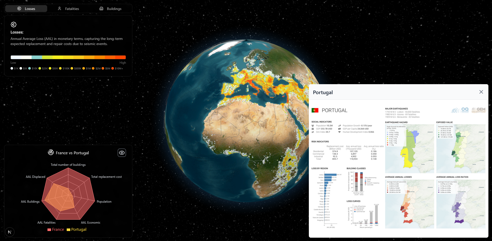

# 3D Globe — Seismic Risk Visualizer

An interactive 3D globe that maps **global seismic risk** at the country level, built as part of a Master's dissertation in Computer Engineering.

## What it shows

The application visualises three dimensions of earthquake risk derived from the [Global Earthquake Model (GEM)](https://www.globalquakemodel.org/) dataset:

| Metric | What it represents |
|--------|--------------------|
| **Losses** | Expected annual monetary damage (Annual Average Loss — AAL) |
| **Fatalities** | Expected annual loss of life from seismic events |
| **Buildings** | Approximate number of buildings exposed to seismic shaking |

Risk intensity is encoded as a colour texture overlaid directly on the globe, enabling immediate spatial comparison across regions.

## Key interactions

- **Rotate & zoom** the globe freely with mouse drag / scroll.
- **Click a country** to open its detailed seismic risk profile.
- **Switch metrics** using the tab bar in the top-left corner.
- **Compare two countries** side-by-side in the radar chart (bottom-left).

## Tech stack at a glance

- [Next.js 15](https://nextjs.org/) (App Router) — framework
- [`react-globe.gl`](https://github.com/vasturiano/react-globe.gl) — Three.js-powered globe
- [Recharts](https://recharts.org/) — radar chart
- [Tailwind CSS](https://tailwindcss.com/) + [shadcn/ui](https://ui.shadcn.com/) — styling
- [Docusaurus](https://docusaurus.io/) — this documentation site

## Where to go next

- [Installation](./getting-started/installation) — run the app locally in minutes.
- [Features](./features/globe) — deep-dive into each part of the UI.
- [Data Reference](./data/data-sources) — understand the underlying dataset.
- [Architecture](./architecture/tech-stack) — explore how the components fit together.
